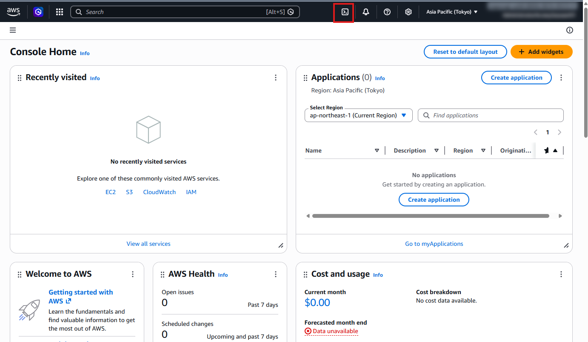
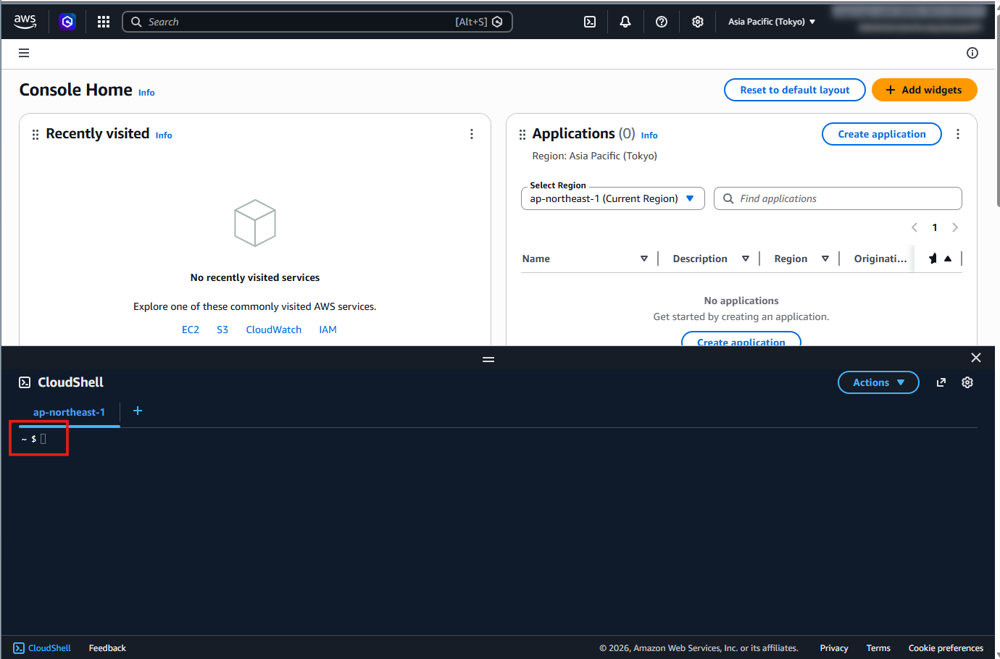
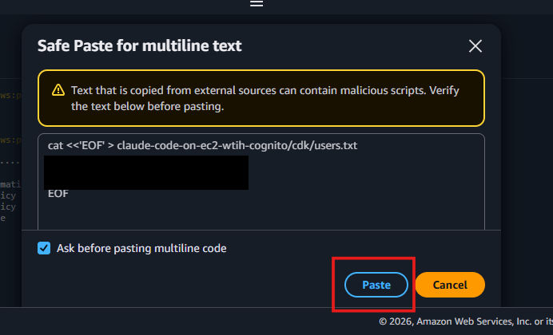
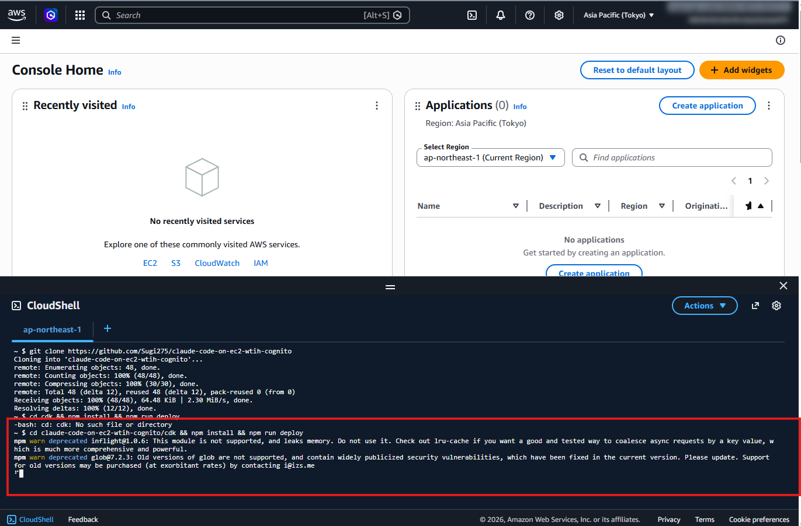
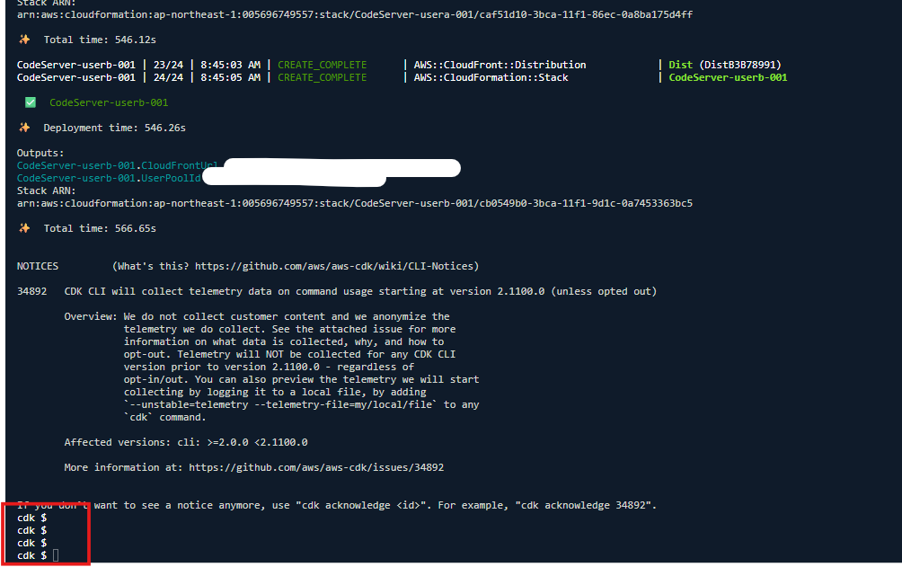

# デプロイ方法

AWS 管理者が AWS CloudShell を使って環境をデプロイする手順です。

## 1. AWS マネジメントコンソールにアクセス

ブラウザで以下の URL にアクセスし、AWS マネジメントコンソールにログインします。

https://ap-northeast-1.console.aws.amazon.com/console/home?region=ap-northeast-1

## 2. CloudShell を起動

画面上部のナビゲーションバーにある **CloudShell アイコン** (赤枠) をクリックします。



画面下部に CloudShell のターミナルが表示されます。`~ $` というプロンプトが表示されたら準備完了です。



## 3. Brave Search API キーを取得・保存

Claude Code で Web 検索を利用するために、AWS Marketplace から Brave Search API をサブスクライブし、API キーを取得します。料金は AWS の請求に統合されます。

API キーの取得手順は以下の記事を参照してください。

https://zenn.dev/aws_japan/articles/aws-marketplace-brave-api

API キーを取得したら、CloudShell で以下のコマンドを実行して保存します。`YOUR_API_KEY` を取得した API キーに置き換えてください。

```
aws ssm put-parameter \
  --name /codeserver/brave-api-key \
  --type SecureString \
  --value "YOUR_API_KEY" \
  --region ap-northeast-1
```

## 4. リポジトリをクローン

CloudShell のターミナルに以下のコマンドを貼り付けて Enter を押します。

```
git clone https://github.com/Sugi275/claude-code-on-ec2-wtih-cognito
```

## 5. ユーザーを設定

以下のコマンドをコピーして CloudShell に貼り付けます。`ユーザー名,メールアドレス` の部分を、実際に利用するユーザーの情報に書き換えてください。

- **ユーザー名**: 半角英字のみ（記号はエラーの原因になるため使用しないでください）
- **メールアドレス**: 招待メールの送信先

```
cat <<'EOF' > ~/claude-code-on-ec2-wtih-cognito/cdk/users.txt
usera,user-a@example.com
userb,user-b@example.com
EOF
```

複数行のテキストを貼り付けると「Safe Paste for multiline text」というダイアログが表示されます。内容を確認して **Paste** ボタンをクリックしてください。



設定内容を確認するには以下のコマンドを実行します。

```
cat ~/claude-code-on-ec2-wtih-cognito/cdk/users.txt
```

## 6. デプロイを実行

以下のコマンドを実行します。

```
cd ~/claude-code-on-ec2-wtih-cognito/cdk && npm install && npm run deploy
```

デプロイが開始されると、画面に進捗状況が表示されます。



デプロイには **約 10〜15 分** かかります。完了すると、各ユーザーの CloudFront URL と User Pool ID が表示されます。



## 7. URL を確認

デプロイ完了後、以下のコマンドで各ユーザーの URL を確認できます。

```
npm run list
```

表示された URL をユーザーにお知らせしてください。ユーザーには招待メールも自動送信されています。

## ユーザーの追加

`users.txt` に新しいユーザーを追加して、再度 `npm run deploy` を実行するだけです。既存ユーザーの環境には影響しません。
